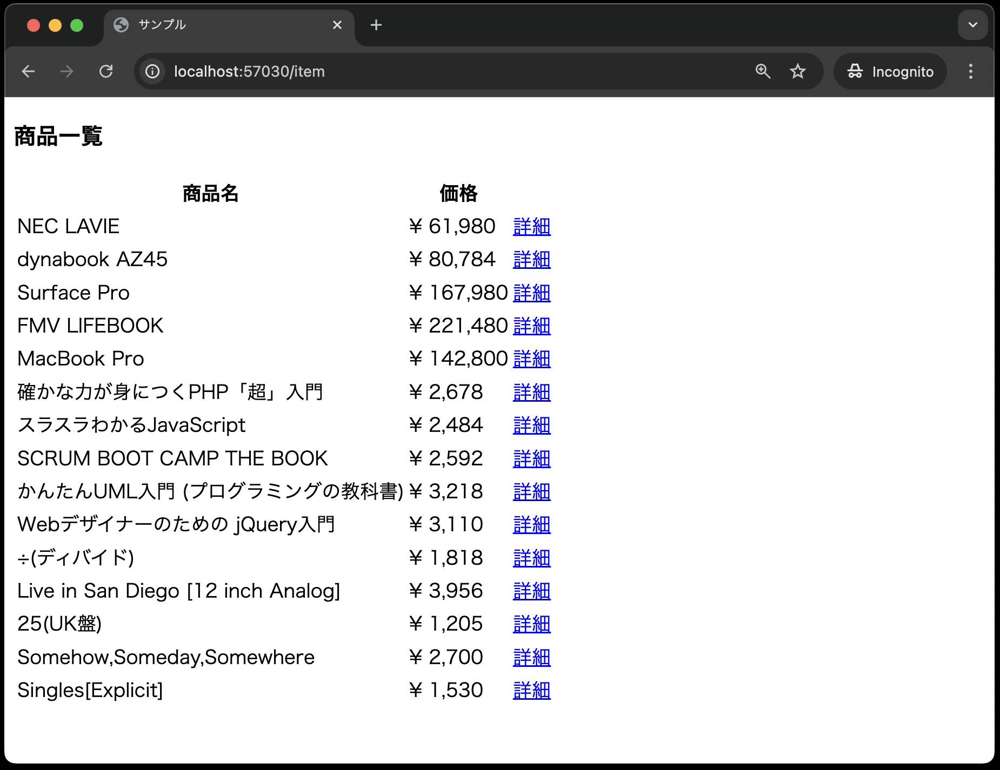
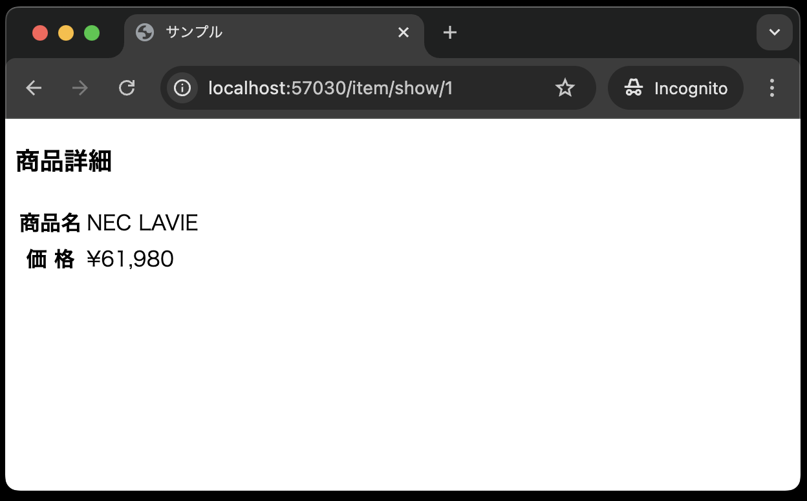

# コントローラとビュー

## コントローラの修正

次に、商品詳細画面のビューを表示するために、コントローラに`show`メソッドを作成します。
Laravelにおける`show`というメソッド名は、一般的に、「IDなどで指定されたリソースを表示するためのメソッド名」として使われます。
今回だと、商品番号に対応する商品情報を表示するためのメソッドとして使います。

`app/Http/Controllers/ItemController.php` を以下のように修正してください。

```php
<?php

namespace App\Http\Controllers;

use App\Models\Item;
use Illuminate\Http\Request;

class ItemController extends Controller
{
    public function index()
    {
        $items = Item::all();
        return view('item.index', compact('items'));
    }

    // --- ここから追加 ---
    public function show(Item $item)
    {
        return view('item.show', ['item' => $item]);
    }
    // --- ここまで追加 ---
}
```

**【解説】**

`public function show(Item $item)`: <br>
`show`メソッドは、商品詳細画面を表示するためのメソッドです。
注目すべきは、いきなり`return`文があることです。

これは、商品番号に対応する商品情報を取得してビューに渡していることを意味します。
これを可能にしているのが、引数の`Item $item`です。

この`$item`には、商品番号に対応する商品情報が**自動的に格納されています。**
この機能が**ルートモデルバインディング(Route Model Binding)**と呼ばれるものです。

復習ですが、このルートモデルバインディングを使用するためには、ルーティングの定義とコントローラのメソッドの引数名が一致している必要があります。
以下のような記述を思い出してみてください。

**`routes/web.php`**

```php
// {item}の部分がコントローラのメソッドの引数名と一致している
Route::get('item/show/{item}', [ItemController::class, 'show'])->name('item.show');
```

**`resources/views/index.blade.php`**

```php
// ルーティングの定義を一致させるために、['item' => $item->ident]で`item`という名前で指定した商品番号を渡している
<a href="{{ route('item.show',  ['item' => $item->ident]) }}">詳細</a>
```


ルートモデルバインディングを使うことで、コントローラで商品番号に対応する商品情報を取得するコードを記述する必要がなくなるので、コードがスッキリします。

## ビューの作成

最後に、商品の詳細画面を作成します。
`resources/views/item`ディレクトリに`show.blade.php`ファイルを作成し、以下のように記述してください。


```php
<!DOCTYPE html>
<html lang="ja">
<head>
<meta charset="UTF-8">
<meta name="viewport" content="width=device-width, initial-scale=1.0">
<title>サンプル</title>
</head>
<body>
<h3>商品詳細</h3>
<table>
    <tr><th>商品名</th>
    <td>{{ $item->name }}</td></tr>
    <tr><th>価 格</th>
    <td>&yen;{{  number_format( $item->price) }}</td></tr>
</table>
</body>
</html>
``` 


以上で、商品詳細画面の作成は完了です。
実際に、動作確認をしてみましょう。
以下のように、商品一覧から商品詳細画面まで遷移できればOKです。


